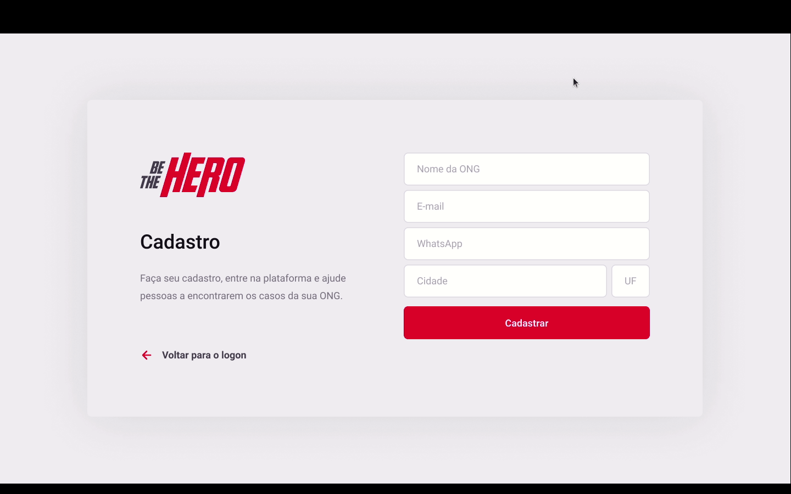

<h1 align="center">
    
</h1>

<h4 align="center"> 
    Semana OmniStack 11 :rocket:
</h4>

<p align="center">
    <a href="https://insomnia.rest/run/?label=Semana%20OmniStack%2011&uri=https%3A%2F%2Fgithub.com%2Fvitorserrano%2Fbethehero-omnistack11%2Fblob%2Fmaster%2Fbackend%2FInsomnia_2020-03-30.json" target="_blank"></a>
</p>


## :rocket: Tecnologias
Este projeto foi desenvolvido com as seguintes tecnologias

- [Node.js](https://nodejs.org/en/) 
- [React](https://reactjs.org)
- [React Native](https://facebook.github.io/react-native/)
- [Expo](https://expo.io/)

---

## :page_with_curl: Projeto
O Be The Hero é um projeto criado pela [Rocketseat](https://rocketseat.com.br/) que visa conectar pessoas dispostas a ajudar ONGs.

---

## :page_facing_up: Funcionalidades
- Login da ONG
- Logout da ONG
- Cadastro de ONG
- Cadastrar novos casos
- Deletar casos
- Listar casos específicos de uma ONG
- Listar todos os casos
- Entrar em contato com a ONG

---

## :page_facing_up: Back-End
1. ```npm init -y``` -> criar arquivos

2.  ```npm install express```

3.  ```npm install nodemon -D ``` (apenas para o desenvolvimento)

4. Dentro de ```package.json``` adicionar: 
    ```javascript 
        "scripts": {
            "start": "nodemon src/index.js"
        }, 
    ```
- Dessa forma, basta utilizar ```npm start``` para iniciar o projeto.

5.  ```npm install cors```


---

## :computer: Front-End Web :heavy_check_mark:

<h1 align="center">
    
</h1>

1. Iniciar projeto -> ```npx create-react-app frontend```

2. startar projeto -> ```npm start```

3. intalar pacote de icons -> ```npm install react-icons```

4. Rotas com ReactJS -> ```npm install react-router-dom```

5. Operações com a API -> ```npm install axios```

---

## :phone: Mobile :heavy_check_mark:

<h1 align="center">
    
</h1>

1. ```npm install @react-navigation/native``` - rotas

2. ```expo install react-native-gesture-handler react-native-reanimated react-native-screens react-native-safe-area-context @react-native-community/masked-view```

3. ```npm install @react-navigation/stack```

4. ```expo install expo-constants```

5. ```expo install expo-mail-composer```

6. ```npm install axios = conexão com api```

7. ```npm install intl```

---

## :page_facing_up: Banco de Dados
O banco de dados utilizado na aplicação é o sqlite3, por isso é necessário aplicar o knex.

1. ```npm install knex```

2. ```npm install sqlite3```

3. ```npx knex init``` -> criar arquivo

4. Dentro do arquivo ```knexfile.js``` -> Alterar o "filename" 
    ```javascript
        development: { 
            client: 'sqlite3',
            connection: { 
               filename: './src/database/db.sqlite'
            },
        },
    ```
5. Adicionar Migrations dentro do arquivo ```knexfile.js```
  ```javascript
        development: {
            client: 'sqlite3',
            connection: {
                filename: './src/database/db.sqlite'
            },
            migrations: {
                directory: './src/database/migrations'
            },
        },
  ```
- **Criar migrations** -> ```npx knex migrate:make create_ongs```
- **Executar migrations** -> ```npx knex migrate:latest```

6. Adicionar useNullAsDefault dentro de ```development``` no arquivo ```knexfile.js```
```javascript
    useNullAsDefault: true,
```

---

## :page_facing_up: Anotações
### Metodos HTTP:
 - **GET**: Buscar/Listar uma informação do back-end
 - **POST**: Criar uma informação no back-end
 - **PUT**: Alterar uma informação no back-end
 - **DELETE**: Deletar uma informação no back-end

### Tipos de Parâmetros
 - Query Params: Parâmetros nomeados enviados na rota após "?" (Filtros, paginação).
 ```javascript
    const params = request.query
 ```

- Route Params: Parâmetros utilizados para identificar recursos.
 ```javascript
    const params = request.params
 ```

- Request Body: Corpo da requisição, utilizado para criar ou alterar recursos.
```javascript
    const body = request.body
```
---

### Formatação de Moedas
- **ReactJS**:
    ```javascript
        {Intl.NumberFormat('pt-BR', {
            style: 'currency', 
            currency: 'BRL'
        }).format(incident.value)}
    ```
    
  - **React Native**:
    - Dentro do App.js:
    ```javascript
        import 'intl';
        import 'intl/locale-data/jsonp/pt-BR';
    ``` 
    
    - No arquivo onde será formatado o valor:
    ```javascript
        {Intl.NumberFormat('pt-BR', {
            style: 'currency', 
            currency: 'BRL'
        }).format(incident.value)}
    ```

## :memo: License

Esse projeto está sob a licença MIT. Veja o arquivo [LICENSE](LICENSE) para mais detalhes.


